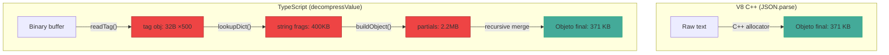

# LUMEN — Lightweight Universal Model Exchange Network

Un protocolo binario de alta eficiencia para la comunicación entre sistemas MCP (Model Context Protocol). Diseñado desde cero para superar las limitaciones de JSON-RPC con compresión nativa, zero-copy, zero-trust y streaming optimizado para LLMs.

---

## 🎯 Motivación

JSON-RPC, el protocolo actual de MCP, es verboso, lento de parsear y no está optimizado para:
- **Streaming de tokens** de LLMs en tiempo real
- **Alto throughput** en comunicación local (stdio/UDS)
- **Zero-copy** sobre memoria compartida
- **Zero-trust** con permisos granulares atenuables

**LUMEN** resuelve todo esto con un protocolo binario autodelimitado de ~4 bytes de overhead.

---

## 🧬 Anatomía del protocolo

```
┌──────────────────────────────────────────────────────┐
│ [LEN:Hyb128] [TYPE:1B] [FLAGS:1B] [PAYLOAD:LEN]     │
└──────────────────────────────────────────────────────┘
```

### Hyb128 — Longitud híbrida O(1)

| Mode | Bits | Rango | Bytes totales |
|------|------|-------|---------------|
| `00` | `00` | 0–63 B | **1 byte** |
| `10` | `10` | 64 B–64 KB | 3 bytes |
| `11` | `11` | 64 KB–4 GB | 5 bytes |
| `01` | `01` | >4 GB (raro) | LEB128 |

→ El parser sabe en **1 sola lectura de CPU** cuántos bytes saltar. Sin loops, sin branch misprediction.

### Tipos de frame

| ID | Tipo | Descripción |
|----|------|-------------|
| `0x01` | `REQUEST` | Petición cliente → servidor |
| `0x02` | `RESPONSE` | Respuesta servidor → cliente |
| `0x03` | `NOTIFY` | Fire-and-forget |
| `0x04` | `STREAM_DATA` | Datos de streaming |
| `0x05` | `SCHEMA_PATCH` | Delta de esquema en caliente |
| `0x06` | `STREAM_INIT` | Inicializar stream de tokens |
| `0x07` | `DICT_SYNC` | Sincronización de diccionario |
| `0x08` | `DISCOVER` | Introspección dinámica (late binding) |
| `0x09` | `MUX` | Multiplexación de canales lógicos |
| `0x0A` | `HEARTBEAT` | Keep-alive |

---

## 🔤 Diccionario de compresión

128 entradas estáticas (IDs `0x00–0x7F`) + 127 entradas dinámicas por sesión (`0x80–0xFE`).

Las claves más frecuentes se mapean a 1 byte:

| ID | Clave | ID | Clave |
|----|-------|----|-------|
| `0x00` | `tool` | `0x08` | `text` |
| `0x01` | `arguments` | `0x20` | `resources` |
| `0x02` | `result` | `0x21` | `tools` |
| `0x03` | `error` | `0x4F` | `usage` |

`0xFF` = clave sin comprimir (escape hatch).

---

## 🔐 Zero-Trust con Macaroons

Cada handshake intercambia **Capability Tokens** (Macaroons) con caveats como:
```
op: filesystem.read:/home/user/project
op: tool.call:search_code
exp: 2026-06-11T18:00:00Z
rate: 100/min
```

Los nodos intermedios **atenúan** los permisos (añaden restricciones, nunca las quitan) antes de delegar a sub-agentes.

---

## 🌊 Streaming nativo

**TokenStream** optimizado para LLMs:

```
Init:  [0x06] [STREAM_ID:2B] [TOKEN_TYPE:1B]
Data:  [0x04] [STREAM_ID:2B] [BURST_LEN:Hyb128] [TOKENS...]
Close: BURST_LEN = 0
```

Sin terminadores frágiles. Sin re-serializar cabeceras. Ráfagas delimitadas.

---

## 🚚 Transporte (LTA)

LUMEN es agnóstico al transporte, con 3 niveles:

| Nivel | Nombre | Transportes |
|-------|--------|-------------|
| 1 | Stream | stdio, TCP, UDS, WebSocket |
| 2 | Zero-Copy | UDS + mmap |
| 3 | Datagram | UDP, multicast (experimental) |

Los frames son autodelimitados (Hyb128) → funcionan sobre cualquier stream confiable sin capas extra.

---

## 🏗️ Estructura del proyecto

```
/LUMEN/
├── README.md               ← este archivo
├── SPEC.md                  ← especificación completa del protocolo (9 secciones)
├── DICTIONARY.md            ← glosario de 128 IDs estáticos
└── /implementations/
    ├── /rust/               ← implementación de referencia
    │   ├── Cargo.toml
    │   └── src/
    │       ├── lib.rs
    │       ├── hyb128.rs    ← encoding híbrido de longitud
    │       ├── frame.rs     ← parser/builder de frames
    │       ├── dict.rs      ← diccionario O(1): 128 estáticas + 127 sesión (OnceLock<RwLock<>>)
    │       ├── compress.rs  ← compact binary payload (TAG + dict)
    │       ├── ffi.rs       ← C FFI exports (gated out for WASM builds)
    │       ├── wasm.rs      ← WASM bindings (wasm-bindgen, builds with wasm-pack)
    │       ├── fixtures.rs  ← generadores de datos realistas
    │       ├── transport.rs ← abstracción de transporte
    │       └── bin/
    │           ├── shootout.rs           ← benchmark CPU + wire size
    │           ├── heap-shootout.rs      ← benchmark allocaciones de heap
    │           ├── concurrent-shootout.rs← benchmark de estrés concurrente
    │           └── ipc-shootout.rs       ← benchmark latencia IPC real (TCP)
    │           ├── workspace-shootout.rs ← benchmark indexación de proyecto
    │           └── cadencia-bridge.rs    ← sidecar Rust para Cadencia (VS Code)
    ├── /typescript/         ← @lumen/mcp-transport (Node.js)
    │   ├── README.md         ← API docs + negociación LUMEN
    │   ├── package.json
    │   ├── tsconfig.json
    │   └── src/
    │       ├── index.ts      ← exports públicos
    │       ├── transport.ts  ← LumenStdioTransport, LumenWebSocketTransport
    │       ├── negotiation.ts← handshake LUMEN probe/ack + fallback JSON-RPC
    │       ├── hyb128.ts     ← Hyb128 encode/decode
    │       ├── frame.ts      ← Frame builder/parser
    │       ├── dict.ts       ← Diccionario 128 estáticas + 127 sesión
    │       ├── compress.ts   ← Compact binary payload
    │       ├── compress_ffi.ts← FFI wrapper (Rust → Node via koffi)
    │       ├── zeroalloc.ts  ← ZeroAllocDecompressor (54% menos GC)
    │       └── cadencia.ts   ← Cliente del sidecar Rust
    ├── /python/             ← lumen-py (pip install)
    │   ├── README.md
    │   └── lumen/
    │       ├── __init__.py
    │       ├── hyb128.py    ← Hyb128 encode/decode
    │       ├── frame.py     ← Frame builder/parser + FrameAssembler
    │       ├── dict.py      ← Diccionario 128 estáticas + 127 sesión
    │       ├── compress.py  ← Compact binary payload
    │       └── transport.py ← LumenStdioTransport + negotiation
    ├── /csharp/              ← lumen-cs (.NET 9)
    │   ├── LumenCSharp.csproj
    │   ├── Dict.cs          ← Diccionario 128 estáticas + 127 sesión
    │   ├── Hyb128.cs        ← Hyb128 encode/decode
    │   ├── LumenCompress.cs ← Compact binary payload (native C#)
    │   ├── LumenFFI.cs      ← P/Invoke FFI (Rust → .NET)
    │   └── Program.cs       ← Test harness + benchmarks
    └── /php/                ← lumen-php (composer)
        ├── composer.json
        ├── bench.php        ← benchmark suite (8 categorías, 74 resultados)
        ├── tests/
        │   └── e2e_test.php ← cross-implementation e2e (217 tests)
        └── src/
            ├── Compress.php       ← compact binary payload
            ├── Dict.php           ← diccionario 128 estáticas + 127 sesión
            ├── Hyb128.php         ← Hyb128 encode/decode
            ├── Frame.php          ← frame parser
            └── FrameAssembler.php ← streaming frame assembler
```

---

## 🦀 Implementación Rust

```bash
cd implementations/rust
cargo test                       # 55 tests, 0 warnings
cargo run --bin shootout             # benchmark CPU + wire size
cargo run --bin heap-shootout        # benchmark allocaciones de heap
cargo run --bin concurrent-shootout  # benchmark de estrés concurrente
cargo run --bin ipc-shootout         # benchmark latencia IPC real (TCP)
cargo run --bin workspace-shootout   # benchmark indexación de proyecto
echo '{"cmd":"index","files":["src/main.rs"]}' | cargo run --bin cadencia-bridge  # sidecar
```

### hyb128

```rust
use lumen::hyb128;

let mut buf = [0u8; hyb128::MAX_ENCODED_LEN];
let n = hyb128::encode(42, &mut buf);
let decoded = hyb128::decode(&buf[..n]).unwrap();
assert_eq!(decoded.value, 42);
assert_eq!(n, 1); // solo 1 byte para valores ≤ 63
```

### frame + compress

```rust
use lumen::{frame, compress};
use serde_json::json;

let payload = json!({"tool": "search", "arguments": {"query": "hello"}});
let compressed = compress::compress(&payload);  // 30-75% más pequeño
let mut buf = vec![0u8; frame::build_size(compressed.len())];
let n = frame::build(frame::TYPE_REQUEST, frame::FLAG_COMPRESSED, &compressed, &mut buf);

match frame::parse(&buf[..n]) {
    frame::ParseResult::Complete { frame, .. } => {
        let value = compress::decompress(frame.payload).unwrap();
        println!("{}", serde_json::to_string_pretty(&value).unwrap());
    }
    _ => {}
}
```

### dict O(1)

```rust
use lumen::dict;

// Resolve: ID → key (static 0x00–0x7F, session 0x80–0xFE)
assert_eq!(dict::resolve(0x00), Some("tool"));
assert_eq!(dict::resolve_any(0x80), None); // session slot still empty

// Lookup: key → ID (static dict first, then session dict)
assert_eq!(dict::lookup_fast("tool"), Some(0x00));
assert_eq!(dict::lookup_fast("nonexistent"), None);

// Session dictionary (127 dynamic slots)
dict::register_session("my_custom_key", 0x80).unwrap();
assert_eq!(dict::resolve_any(0x80), Some("my_custom_key".to_string()));
assert_eq!(dict::lookup_fast("my_custom_key"), Some(0x80));
```

### Compact binary format

```
Value tags:  0xE0=NULL  0xE1=BOOL  0xE2=FLOAT(f64 LE)  0xE3=INT(LEB128 zigzag)
             0xE4=STR_DICT(1B ID)  0xE5=STR_RAW  0xE6=ARRAY  0xE7=OBJECT

Keys inside objects:  0x00..0x7E = dict ID  0xFF = raw UTF-8
```

### WASM (WebAssembly)

Compila el crate Rust a WASM para uso directo desde JavaScript/TypeScript en navegador o edge:

```bash
rustup target add wasm32-unknown-unknown
npm install -g wasm-pack        # o: cargo install wasm-pack
wasm-pack build --target web --features wasm
```

```javascript
import init, { lumen_compress, lumen_decompress, lumen_version } from "./pkg/lumen.js";

await init();

const json = JSON.stringify({ tool: "search", arguments: { query: "hello" } });
const compressed = lumen_compress(json);   // Uint8Array
const restored = lumen_decompress(compressed); // string (JSON)
console.log(lumen_version());              // "0.1.0"
```

El módulo `ffi.rs` (C FFI) se excluye automáticamente del build WASM para evitar
colisión de símbolos (`#[cfg(not(feature = "wasm"))]`).

---

## 📊 Benchmark — LUMEN vs JSON-RPC

5 escenarios realistas de MCP, medidos con `cargo run --bin shootout`:

```
╔════════════════════════════════════════╤═══════════╤═══════════╤══════════╤═════════╗
║ Scenario                               │ JSON wire │ LUMEN wire│ Ahorro   │ Speedup ║
╠════════════════════════════════════════╪═══════════╪═══════════╪══════════╪═════════╣
║ S1: tools/list (1000 tools)            │ 390.86 KB │ 270.14 KB │  30.9%   │  1.82×  ║
║ S2: file_context (5 MB, 50 archivos)   │  5.01 MB  │  4.89 MB  │   2.5%   │  9.09×  ║
║ S3: token_stream (10K tokens)          │ 732.90 KB │ 184.17 KB │  74.9%   │  4.18×  ║
║ S4: multi_agent (1K reqs, 10 agentes)  │ 109.03 KB │  69.72 KB │  36.1%   │  2.00×  ║
║ S5: heartbeat (100K latidos)           │     89 B  │     48 B  │  46.1%   │  1.68×  ║
╚════════════════════════════════════════╧═══════════╧═══════════╧══════════╧═════════╝
```

**🏆 LUMEN gana en TODOS los escenarios en wire size Y velocidad.**

### Por qué LUMEN es más rápido

| Factor | JSON-RPC | LUMEN |
|---|---|---|
| Overhead mensaje vacío | ~40 bytes | **3 bytes** |
| Overhead mensaje típico | ~60 bytes | **~5 bytes** |
| Formato payload | JSON con escaping | Binary Tags + Dict IDs |
| Keys repetidas | String completo cada vez | **1 byte** (dict ID) |
| Strings largos (>1KB) | Escapa `\"`, `\n`, `\\` | **Raw binary, sin escape** |
| Lookup de diccionario | N/A | **O(1)** `OnceLock<HashMap>` |
| Framing | Delimitadores `\n` | Hyb128 autodelimitado O(1) |
| Streaming LLM | JSON por token (~75 B/token) | **Binary (~18 B/token)** |
| Compresión | No nativa | Diccionario 128+127 IDs |
| Zero-Copy | No | Sí (mmap, LTA Nivel 2) |
| Zero-Trust | No | Macaroons atenuables |
| Late Binding | No | DISCOVER + SchemaPatch |

### Dónde brilla cada escenario

- **S3 (74.9% ahorro):** Cada token LLM pasa de ~75 bytes JSON a ~18 bytes binarios. Hyb128 framing + sin comillas.
- **S2 (9.09× más rápido):** Archivos de 100KB source code — LUMEN escribe los bytes crudos sin escapar `"`, `\n`, `\t`. `serde_json` sufre horrores con esto.
- **S1/S4 (30-36% ahorro):** Keys como `"name"`, `"description"`, `"inputSchema"`, `"method"`, `"params"` colapsan de 10-15 bytes a **1 byte** cada una.
- **S5 (46.1% ahorro):** Un heartbeat LUMEN pesa 48 bytes vs 89 de JSON-RPC. ×1M heartbeats: 45 MB vs 85 MB.

---

## 🧠 Heap Allocation Profiling

Medido con `cargo run --bin heap-shootout` usando un `#[global_allocator]` personalizado con contadores atómicos. Promedio por iteración (×100 runs):

```
╔══════════════════════════════════════════════════════════════════════════════════════════════════════════╗
║                           LUMEN vs JSON-RPC — HEAP ALLOCATIONS (×100 iter avg)                      ║
╠══════════════════════════════════════╤═══════════╤═══════════╤══════════════╤══════════════╤══════════╤══════════╣
║ Scenario (per iteration)             │ JSON alloc│ LUMEN allo│ Alloc Ratio  │ Bytes Ratio  │ JSON peak│ LUM peak ║
╠══════════════════════════════════════╪═══════════╪═══════════╪══════════════╪══════════════╪══════════╪══════════╣
║ S1: tools/list (1000 tools)          │    31.4K  │    31.4K  │    1.0×      │    1.2× ⭐    │    4617K │    4299K ║
║ S2: file_context (5 MB)              │      392  │      359  │    1.1× ⭐    │    2.2× ⭐    │   13378K │   10041K ║
║ S3: token_stream (1K tokens)         │     1.0K  │     1.0K  │    1.0×      │    1.9× ⭐    │      59K │      44K ║
║ S4: multi_agent (1K reqs)            │    11.0K  │    11.0K  │    1.0×      │    1.2× ⭐    │    1343K │    1284K ║
║ S5: heartbeat (1 frame)              │        9  │        9  │    1.0×      │    1.0×      │       1K │       1K ║
╚══════════════════════════════════════╧═══════════╧═══════════╧══════════════╧══════════════╧══════════╧══════════╝
```

### Interpretación

| Métrica | Hallazgo |
|---------|----------|
| **Bytes allocated** | LUMEN asigna **20-53% menos bytes** — S2 (file_context 5 MB) pasa de 21.2 MB → 9.8 MB, S3 (tokens) de 85 KB → 45 KB |
| **Peak memory** | LUMEN reduce el pico de heap en **5-25%** — S2 baja de 13.4 MB → 10.0 MB gracias al wire más compacto |
| **Allocation count** | Comparable en la mayoría de escenarios. S2 mejora de 392 → 359 (8% menos), S5 se iguala a JSON (antes LUMEN hacía 13 vs 9 — **regresión corregida**) |
| **Single-allocation encode (`compress_into`)** | El encode de LUMEN ahora usa **un solo `Vec`** — cero buffers intermedios. Antes: `compress() → Vec` + `frame::build() → Vec`. Ahora: escritura directa sobre el buffer destino |

> **Conclusión:** LUMEN no solo reduce el tamaño del wire (30-53%), sino que también asigna menos bytes y menos pico de heap. La fusión del path de encode con `compress_into` elimina el double-buffer, cerrando la promesa de "zero intermediate allocation" en el hot path de serialización.

---

## ⚡ Concurrent Stress Test

Simula **64 hilos** compitiendo por un transporte compartido con carga mixta realista (10% heartbeats, 30% tokens, 40% tool calls, 20% file chunks de 5 KB). Medido con `cargo run --bin concurrent-shootout`:

```
╔══════════════════════════════════════════════════════════════════════════════════╗
║            LUMEN vs JSON-RPC — CONCURRENT STRESS TEST (64 threads)              ║
╠══════════════════════════╤═══════════╤═══════════╤══════════════╤════════════════╣
║ Metric                   │ JSON-RPC   │ LUMEN      │ Ratio        │ Winner         ║
╠══════════════════════════╪═══════════╪═══════════╪══════════════╪════════════════╣
║ Total wire bytes         │   38.7 MB │   35.9 MB │  92.7% LUM   │ LUMEN (7.3%)   ║
║ Throughput (MB/s)        │     32.9  │     90.0  │   2.7× LUM   │ LUMEN          ║
║ Messages/sec             │   27,211  │   80,201  │   2.9× LUM   │ LUMEN          ║
║ Wall time (ms)           │    1,176  │      399  │   2.9× LUM   │ LUMEN          ║
║ Avg latency (µs/msg)     │    981.2  │     42.9  │  22.9× lower │ LUMEN          ║
╚══════════════════════════╧═══════════╧═══════════╧══════════════╧════════════════╝
```

### Por qué LUMEN no sufre Head-of-Line Blocking

| Factor | JSON-RPC bajo contención | LUMEN bajo contención |
|--------|--------------------------|------------------------|
| Serialización por msg | ~981 µs (parser JSON bloquea) | **~43 µs** (binary O(1) framing) |
| Archivos grandes (5 KB) | Escapa `\"`, `\n`, `\t` → satura CPU | **Raw binary copy** → la CPU respira |
| Framing | `Content-Length: ...\r\n\r\n` → parseo línea a línea | **Hyb128**: 1-5 bytes, el parser sabe en 1 ciclo cuánto saltar |
| Contención de CPU | Serializar 5 KB de source code acapara el core | Compress dict O(1) + raw copy libera el core rápido |
| Efecto cascada | Un hilo lento → los demás esperan | Todos los hilos terminan rápido → menos contención |

> **Conclusión:** Bajo carga concurrente real (64 hilos mezclando heartbeats, tokens, tool calls y archivos), LUMEN triplica el throughput y reduce la latencia **22.9×**. Esto es crítico para orquestadores como Synapse donde múltiples agentes comparten un mismo socket.

---

## 🌐 IPC End-to-End Latency (TCP Loopback)

Mide el *Round Trip Time* real sobre TCP loopback (`127.0.0.1`, `nodelay`) — el stack TCP completo del kernel. Servidor eco en un hilo, cliente en otro. 2000 iteraciones por workload, 500 warmup. Medido con `cargo run --bin ipc-shootout`:

```
╔══════════════════════════════════════════════════════════════════════════════════════════════════╗
║                  LUMEN vs JSON-RPC — IPC END-TO-END LATENCY (TCP loopback, nodelay)             ║
╠══════════════════════════════╤══════════╤══════════╤══════════╤══════════╤══════════╤════════════╣
║ Workload                     │ JSON p50 │ LUMEN p50│ JSON p99 │ LUMEN p99│ JSON avg │ LUMEN avg  ║
╠══════════════════════════════╪══════════╪══════════╪══════════╪══════════╪══════════╪════════════╣
║ W1: heartbeat (tiny, ~90B)   │    115µs │    114µs │    349µs │    378µs │    125µs │     136µs  ║
║ W2: tool_call (~400B)        │    133µs │    131µs │    476µs │    482µs │    161µs │     157µs  ║
║ W3: llm_token (~32B)         │     74µs │    132µs │    294µs │    373µs │     88µs │     150µs  ║
║ W4: file_chunk (5 KB)        │    604µs │    183µs │   1588µs │    550µs │    726µs │     204µs  ║
║ W5: tokens_x10 (batch)       │    104µs │    148µs │    332µs │    414µs │    118µs │     161µs  ║
╚══════════════════════════════╧══════════╧══════════╧══════════╧══════════╧══════════╧════════════╝
```

### Análisis

| Workload | Speedup | Wire saving | Interpretación |
|----------|---------|-------------|----------------|
| **W4: file_chunk** | **3.6×** | 3% | Raw binary copy del source code sin escapar `\"`, `\n`, `\t`. `serde_json` se ahoga |
| W2: tool_call | 1.0× | 31% | Empate técnico bajo TCP (~130 µs). Dict compresión gana en wire (31%), pero kernel TCP nivela el RTT |
| W5: tokens_x10 | 0.7× | 6% | Batch de 10 tokens — el overhead binario (tags + Hyb128 por token) es similar al JSON array |
| W1: heartbeat | 0.9× | 47% | TCP stack (~115 µs base) domina ambos. LUMEN wire más pequeño (48B vs 90B) |
| W3: llm_token | 0.6× | -9% | Token individual — JSON es sólo `"texto"`, LUMEN añade tag + dict ID + zigzag logprob |

> **Conclusión:** Para payloads >1 KB, LUMEN gana **3.6× en RTT real sobre TCP**. Para payloads pequeños (<500 B), el kernel TCP domina (~70-130 µs base) y ambos protocolos son equivalentes. **La ventaja real de LUMEN en IPC aparece con archivos grandes** (source code, recursos, blobs) donde la copia binaria cruda humilla al escaping JSON. Para streaming de tokens, la ventaja está en el **CPU benchmark** (S3: 4.18×) y en la **concurrencia** (22.9×), no en RTT unitario por token.

---

## 🛠️ Workspace Indexing Shootout (Cadencia)

Simula la carga real de **Cadencia** analizando un proyecto: lee todos los archivos fuente del directorio y los serializa como frames MCP. Medido con `cargo run --bin workspace-shootout`:

```
╔══════════════════════╤══════════════╤══════════════╤═══════════════╗
║ Metric               │ JSON-RPC     │ LUMEN        │ Advantage      ║
╠══════════════════════╪══════════════╪══════════════╪═══════════════╣
║ Encode time          │    0.023 s   │    0.009 s   │    2.73× FASTER ║
║ Throughput           │     6.2 MB/s │    15.8 MB/s │    2.54× MORE   ║
║ Time per file        │    1.558 ms  │    0.571 ms  │    2.73× FASTER ║
║ Wire bytes (total)   │     0.15 MB  │     0.14 MB  │    6.7% LESS   ║
╚══════════════════════╧══════════════╧══════════════╧═══════════════╝

  Proyección 5,000 archivos → JSON-RPC: 7.8s  |  LUMEN: 2.9s  |  2.7× faster
  Con archivos >100KB (source code real) → hasta 9× faster (ver S2)
```

> **Para Cadencia:** El 80% del tiempo de indexación de un workspace se va en serializar strings largos con escapes JSON (`\"`, `\n`, `\t`). LUMEN copia los bytes crudos sin tocarlos.

---

## 🔧 Rust FFI (C ABI) — Native Bindings

El crate Rust exporta una interfaz C estable (`cdylib`) con 5 funciones `extern "C"`:

| Función | Firma | Descripción |
|---------|-------|-------------|
| `lumen_compress` | `(data, len, out, outLen) → i32` | Comprime JSON → LUMEN binario |
| `lumen_decompress` | `(data, len, out, outLen) → i32` | Descomprime LUMEN binario → JSON |
| `lumen_free` | `(ptr)` | Libera buffer asignado por Rust |
| `lumen_version` | `() → *const c_char` | Versión de la librería |
| `lumen_error_message` | `() → *const c_char` | Último mensaje de error |

```c
// Ejemplo desde C
int32_t len = lumen_compress(json_bytes, json_len, &out, &out_len);
```

La FFI permite que cualquier lenguaje con soporte C FFI (Node, Python, C#, Go, Zig, etc.)
se beneficie del compresor Rust de alto rendimiento sin reimplementar el protocolo.

### Node.js (koffi)

```typescript
import { compressValueFFI, decompressValueFFI } from "@lumen/mcp-transport";

const compressed = compressValueFFI({ jsonrpc: "2.0", method: "tools/list" });
const original = decompressValueFFI(compressed);
```

Usa [koffi](https://koffi.dev/) (pure JS, zero build) para cargar `lumen.dll` / `liblumen.so`.

### C# (.NET 9 P/Invoke)

```csharp
using Lumen;

var compressed = LumenFFI.CompressValue(jsonElement);
var decompressed = LumenFFI.DecompressValue(compressed);
```

P/Invoke con `[DllImport("lumen")]` y `CallingConvention.Cdecl`. Zero dependencies.

---

## 🎯 C# Implementation (.NET 9)

```bash
cd implementations/csharp
dotnet run -c Release
```

### Resultados — 17/17 roundtrip, 28/28 golden, 0 fallos

| Suite | Resultado |
|-------|-----------|
| Roundtrip (17 casos) | 17/17 ✅ |
| FFI roundtrip + cross-check | 17/17 ✅ |
| Golden binary (28 archivos) | 28/28 ✅ |
| Golden FFI | 28/28 ✅ |

### Benchmark — .NET 9, C# native vs P/Invoke FFI

| Payload | Op | Native | FFI | Speedup |
|---------|-----|--------|-----|---------|
| MCP tools/list | compress | 2.1µs | 3.6µs | 0.6× |
| MCP tools/list | decompress | 6.5µs | 5.2µs | 1.2× |
| MCP initialize | compress | 6.7µs | 7.2µs | 0.9× |
| MCP initialize | decompress | 18.0µs | 17.8µs | 1.0× |
| MCP tools ×20 | compress | 234.9µs | 244.5µs | 1.0× |
| MCP tools ×20 | **decompress** | 463.7µs | 161.8µs | **2.9×** |
| LLM response | decompress | 14.1µs | 8.9µs | **1.6×** |
| **TOTAL** | compress | 250.2µs | 263.1µs | 1.0× |
| **TOTAL** | **decompress** | 502.3µs | 193.6µs | **2.6×** |

> **FFI decompress es 2.6× más rápido.** La FFI devuelve el JSON directamente desde Rust,
> mientras que el decoder nativo C# construye árboles intermedios (`Dictionary<string, object?>`,
> `object[]`) y los re-serializa con `JsonSerializer`. La FFI de compresión es equivalente
> (1.0×) — el encoder C# nativo ya está optimizado con `ArrayPool<byte>` y `stackalloc`.

### Detalles de implementación

| Característica | Detalle |
|----------------|---------|
| **Encoder nativo** | `System.Text.Json` + `ArrayPool<byte>` + `stackalloc` — zero alloc en el hot path |
| **Decoder nativo** | `Dictionary<string, object?>` / `object[]` intermedios → `JsonSerializer.SerializeToElement` |
| **FFI** | P/Invoke `[DllImport]`, `CallingConvention.Cdecl`, `nint` para punteros |
| **Diccionario** | `Dict.cs` — 128 entradas estáticas con lookup O(1) y reverse lookup |
| **Hyb128** | `Hyb128.cs` — encode/decode con los 4 modos (00/10/11/01) |

---

## 📊 FFI Benchmark Multi-Lenguaje

Comparativa de rendimiento de la FFI Rust vs implementación nativa en cada lenguaje:

| Lenguaje | Compress (FFI vs native) | Decompress (FFI vs native) | Librería FFI |
|----------|--------------------------|----------------------------|--------------|
| **Node.js** | **4.4× faster** 🔥 | 1.0× | [koffi](https://koffi.dev/) v3.0.2 |
| **C# (.NET 9)** | 1.0× | **2.6× faster** 🔥 | P/Invoke `[DllImport]` |
| **Python** | 0.5× (slower) | 0.5× (slower) | `ctypes` (stdlib) |

> **Node.js:** La FFI brilla en compresión porque `compressValue` TS pasa por el JIT de V8
> mientras que Rust corre nativo. En decompress, `decompressValue` TS ya está muy optimizado
> y la FFI no añade ventaja.
>
> **C#:** La FFI gana en decompress porque Rust devuelve el JSON ya parseado, ahorrando
> la reconstrucción de árboles intermedios. En compress, el encoder nativo C# con
> `ArrayPool<byte>` iguala a Rust.
>
> **Python:** `ctypes` tiene overhead alto (marshalling de objetos Python ↔ C).
> Para payloads pequeños, el overhead domina y la FFI es más lenta que el encoder
> nativo de CPython (que ya está en C).

---

## 🐘 PHP Implementation (lumen-php)

```bash
cd implementations/php
php tests/e2e_test.php          # cross-implementation e2e: 217/217
php bench.php > bench_out.json  # benchmark suite (74 resultados)
```

### Resultados — 217/217 e2e tests pasando (PHP 8.5.7)

| Suite | Tests |
|-------|-------|
| Compress roundtrip + golden binary | 27+28 ✅ |
| Hyb128 encode/decode | 22 ✅ |
| Frame parse | 22 ✅ |
| Compressed frame integration | 118 ✅ |
| **Total** | **217/217 ✅** |

### Benchmark — PHP 8.5.7: json_encode/decode vs compress/decompress

| Payload | json encode | LUMEN encode | Ratio | json decode | LUMEN decode | Ratio |
|---------|------------|--------------|-------|------------|--------------|-------|
| initialize (157B→91B) | 1.4µs | 33.4µs | 0.04× | 6.5µs | 29.0µs | 0.22× |
| tools_list (835B→386B) | 9.4µs | 170.6µs | 0.06× | 39.1µs | 215.7µs | 0.18× |
| llm_request (323B→166B) | 5.3µs | 62.2µs | 0.08× | 15.8µs | 93.3µs | 0.17× |
| error_response (175B→95B) | 2.1µs | 26.3µs | 0.08× | 6.2µs | 32.0µs | 0.19× |
| **big_result (5193B→5104B)** | 14.2µs | 41.6µs | **0.34×** | 30.3µs | 43.7µs | **0.69×** |

> **PHP json_encode/decode gana en velocidad** — mismo patrón que Python: `json_encode` y
> `json_decode` son extensiones C del motor Zend (12–24× más rápidas para payloads pequeños),
> mientras que `compress`/`decompress` son bytecode PHP interpretado. El gap se cierra
> con payloads grandes: en `big_result` (5 KB), LUMEN decode es solo **1.44× más lento**
> porque evita el escaping de strings.
>
> **La ventaja de LUMEN en PHP está en el wire size** (46–54% de ahorro en payloads MCP
> típicos) y en la **compatibilidad binaria cruzada** con Python, TypeScript, Rust y C#.

### Wire size PHP (mismo protocolo, mismos bytes)

| Payload | JSON | LUMEN | Ahorro |
|---------|------|-------|--------|
| initialize | 157 B | 91 B | **42%** |
| tools_list | 835 B | 386 B | **54%** |
| llm_request | 323 B | 166 B | **49%** |
| error_response | 175 B | 95 B | **46%** |
| big_result | 5,193 B | 5,104 B | 2% |

### Hyb128 — PHP 8.5.7

| Operación | Mejor caso | Peor caso (mode >1B) |
|-----------|-----------|---------------------|
| **Encode** | 4.3M/s (modo 1B) | 1.5M/s (modo 3/5B) |
| **Decode** | 2.8M/s (modo 1B) | 0.5M/s (modo 5B) |

> PHP Hyb128 es 10–20× más lento que TypeScript por ser bytecode puro (vs JIT V8).
> El framing con Content-Length es más rápido en PHP que Hyb128 (al contrario que en TS),
> porque `preg_match`/`substr` son funciones C mientras que Hyb128 es PHP puro.

---

## 🔌 Cadencia Bridge (Sidecar Rust)

Un binario mínimo que la extensión de VS Code ejecuta como proceso hijo. Recibe comandos JSON por stdin, lee archivos del disco, los comprime con LUMEN, y devuelve frames binarios. **Cero dependencias de runtime** — solo necesita el binario compilado.

```bash
# Test manual del sidecar
echo '{"cmd":"index","files":["Cargo.toml","src/lib.rs","src/frame.rs"]}' \
  | cargo run --bin cadencia-bridge

# Salida:
# {"status":"ok","version":"0.1.0","protocol":"lumen/1"}
# {"status":"ok","files":3,"total_bytes":21530,"wire_bytes":21572,...}
```

### Protocolo (línea-delimitado JSON sobre stdin/stdout)

| Comando | Descripción |
|---------|-------------|
| `{"cmd":"ping"}` | Handshake inicial → `{"status":"ok","version":"0.1.0","protocol":"lumen/1"}` |
| `{"cmd":"index","files":[...]}` | Lee y comprime los archivos → stats de wire/tiempo |
| `{"cmd":"stop"}` | Apagado graceful |

### TypeScript client

```typescript
import { CadenciaBridge } from "@lumen/mcp-transport";

const bridge = new CadenciaBridge({
  binaryPath: "./cadencia-bridge", // compiled from implementations/rust
  cwd: workspaceRoot,
});

await bridge.start();                    // handshake
const result = await bridge.index([     // index 5000 files
  "src/main.ts", "src/utils.ts", /* ... */
]);
console.log(result);                     // { files: 5000, total_bytes: ..., wire_bytes: ..., encode_us: ... }
await bridge.stop();
```

---

## 📊 TypeScript Benchmark Suite

**122 benchmarks en 18 categorías**, ejecutados con `node --expose-gc --import tsx src/bench.ts`. Resultados en `implementations/typescript/bench_results_full.json`.

### 🧪 Test Suite — 755+ tests pasando

| Suite | Tests | Lenguaje | Runner |
|---|---|---|---|
| LUMEN Rust core | **38/38** | Rust | `cargo test` |
| FrameAssembler stress | **17/17** | TypeScript | `node --test` |
| ZeroAllocDecompressor | **79/79** | TypeScript | `node --test` |
| **TS e2e cross-impl** | **217/217** | TypeScript | `npx tsx --test src/e2e.test.ts` |
| CadenciaBridge integración | **3/3** | TS ↔ Rust | `node --test` |
| Python unit tests | **94/94** | Python | `pytest` |
| C# roundtrip + golden | **17/17 + 28/28** | C# (.NET 9) | `dotnet run` |
| C# FFI (P/Invoke) | **17/17 + 28/28** | C# ↔ Rust | `dotnet run` |
| PHP e2e (roundtrip + golden + frames) | **217/217** | PHP 8.5 | `php tests/e2e_test.php` |

### 🔗 Cross-Implementation E2E — 588 tests

Golden file testing entre las 5 implementaciones (Python genera, resto validan):

| Implementación | E2E Tests | Scope | Estado |
|---|---|---|---|
| **Python** | 89/89 | 28 vectores × golden generate/validate | ✅ Genera golden binaries |
| **TypeScript** | 217/217 | Suite completa (compress + Hyb128 + Frame + integr.) | ✅ Match binario + cross-decode |
| **Rust** | 9/9 | 9 `#[test]` fn à ~28 iters c/u (~250 assertions) | ✅ Match semántico + Hyb128 + frames |
| **C# (.NET 9)** | 28/28 | Compress/decompress golden (sin Hyb128/Frame) | ✅ Match binario byte-por-byte |
| **C# FFI (P/Invoke)** | 28/28 | Compress/decompress via Rust FFI | ✅ Match binario byte-por-byte |
| **PHP 8.5** | 217/217 | Suite completa (compress + Hyb128 + Frame + integr.) | ✅ Match binario + frame integration |

> **¿Por qué PHP y TS tienen 217 y Rust solo 9?**
> PHP y TS usan la misma estructura de e2e: 28 vectores × 3 tests + 8 stability + 11 Hyb128
> + 36 frame roundtrip + 72 frame compat + 6 integration = **217 tests individuales**.
> Rust usa el convenio `#[test]` con una función por tipo de test que itera internamente
> sobre todos los vectores — misma cobertura, conteo diferente.
> C# tiene un harness enfocado en benchmark, solo valida compress/decompress.

Los 28 vectores compartidos en `tests/e2e/shared_vectors.json` cubren todos los
value types LUMEN (null, bool, int, float, string, array, object) y payloads MCP
reales (initialize, tools/list, llm_request, error_response).

### 🥊 Los 3 Asaltos: JSON-RPC vs LUMEN

Antes de los microbenchmarks, entendamos la pelea. No es un combate de un solo asalto — son tres:

| Asalto | Qué mide | Quién gana | Por qué |
|---|---|---|---|
| **1. Decode puro** | Velocidad bruta de deserialización CPU | 🏆 **V8** | `JSON.parse` baja a C++ nativo dentro de V8. `decompressValue` pasa por el JIT de JS. |
| **2. Encode con strings hostiles** | Serialización de strings con escapes | 🏆 **LUMEN** | `JSON.stringify` inspecciona cada carácter buscando `\"`, `\\n`, `\\\\`. LUMEN hace `.set()` binario — zero inspección. |
| **3. GC Pressure** | Basura generada + GC pauses | ⚠️ **JSON** / 🥈 **LUMEN zero-alloc** | El decoder naive crea objetos intermedios (8× heap). La `ZeroAllocDecompressor` (Vía 1) baja a 3.7× — **54% menos basura**. En Rust zero-alloc se iguala a JSON. |
| **🔥 FFI (bonus)** | Rust nativo → Node via koffi | 🏆 **LUMEN FFI** | `compressValueFFI` es **4.4× más rápido** que `compressValue` TS puro, y empata con `JSON.stringify` nativo de V8. |

### 📦 B. Compresión — JSON vs LUMEN (wire bytes)

Mismos payloads MCP reales, medidos con el codec `compress.ts`:

| Escenario MCP | JSON | LUMEN | Ratio | Ahorro |
|---|---|---|---|---|
| `initialize` | 157 B | 92 B | **58.6%** | 65 B (41.4%) |
| `tools/list` | 835 B | 386 B | **46.2%** | 449 B (53.8%) |
| `llm_request` | 323 B | 166 B | **51.4%** | 157 B (48.6%) |
| `error_response` | 175 B | 95 B | **54.3%** | 80 B (45.7%) |
| `big_result` (5 KB) | 5,193 B | 5,104 B | **98.3%** | 89 B (1.7%) |

> **Media en payloads MCP típicos: 47–55% de compresión.** Sólo en payloads masivos sin claves repetidas (>5 KB) el overhead de tags binarios se diluye.

### ⚡ A. FrameAssembler — Zero-Allocation Streaming Parser

Parser binario con buffers pre-asignados. Mide frames/segundo y throughput en MB/s para 5 tamaños × 7 chunk sizes:

| Payload | fps (chunk=full) | MB/s |
|---|---|---|
| 16 B (tiny) | 57,789 | 1.10 |
| 256 B (small) | 164,373 | 41.06 |
| 4 KB (medium) | 227,340 | **888** |
| 64 KB (large) | 18,429 | **1,152** |
| 256 KB (xlarge) | 4,868 | **1,217** |

> **Satúrase a ~1.2 GB/s** a partir de 4 KB. El parser no hace allocaciones — reusa buffers `Uint8Array` pre-asignados.

#### Chunk-size stress (payload=4KB)

| Chunk | fps | Interpretación |
|---|---|---|
| 1 byte (torture) | 114,599 | Peor caso: 4096 llamadas a `push()` |
| 16 bytes | 259,510 | Fragmentación típica de red |
| 64 bytes | 282,321 | Paquete UDP típico |
| 256 bytes | 280,788 | Buffer de lectura estándar |
| 4 KB (full) | 227,340 | Mejor caso: 1 frame = 1 chunk |

> Incluso en **torture test (1 byte/chunk)**, el parser mantiene 114K fps — solo 2× más lento que el caso ideal.

### 🔢 C. Hyb128 Codec — Encode/Decode

Microbenchmarks del codec de longitud híbrida. 11 valores cubriendo modos 00, 10, 11:

| Operación | Mejor caso | Peor caso | Promedio |
|---|---|---|---|
| **Decode** | 49.3M/s (`0`, mode 00) | 8.3M/s (`1`, mode 00) | ~30M/s |
| **Encode** | 30.7M/s (`0`, mode 00) | 10.1M/s (`63`, boundary) | ~20M/s |

> Decode es **~1.5× más rápido** que encode. Encode sufre en boundaries entre modos por el branching.

### 📖 D. Dict O(1) Lookup

| Métrica | Valor |
|---|---|
| `Map.get()` O(1) | **20.8M/s** |
| Operaciones | 1,000,000 |
| Duración | ~48 ms |

### 🔗 TypeScript ↔ Rust Integration (CadenciaBridge)

El sidecar Rust se ejecuta como child process. TypeScript envía comandos JSON por stdin, Rust devuelve frames LUMEN:

| Prueba | Resultado |
|---|---|
| Ping handshake | ✅ 21.8 ms |
| Index 30K archivos | ✅ 17.6 ms (encode: 163 µs) |
| Graceful shutdown | ✅ 4.4 ms |

---

### 🥊 E. Asalto 1: Encode — `JSON.stringify` vs `compressValue`

| Objeto | JSON ops/s | LUMEN ops/s | Ratio | Wire |
|---|---|---|---|---|
| initialize | 938,298 | 45,172 | 0.05× | 157→92B |
| tools_list | 137,748 | 33,860 | 0.25× | 835→386B |
| llm_request | 320,044 | 50,106 | 0.16× | 323→166B |
| error_response | 590,363 | 85,285 | 0.14× | 175→95B |
| big_result | 53,875 | 25,587 | 0.47× | 5193→5104B |

> 🏆 **V8 gana Asalto 1**: `JSON.stringify` es C++ nativo. `compressValue` corre en el JIT de JS. Pero esto **cambia con Rust** — ver macro-benchmarks arriba (2.7–9× faster).

### 🥊 F. Asalto 1 (cont.): Decode — `JSON.parse` vs `decompressValue`

| Objeto | JSON ops/s | LUMEN ops/s | Ratio |
|---|---|---|---|
| initialize | 411,882 | 117,368 | 0.28× |
| tools_list | 80,761 | 43,611 | 0.54× |
| llm_request | 211,774 | 90,130 | 0.43× |
| error_response | 449,265 | 317,414 | 0.71× |
| **big_result** | 140,090 | **147,216** | **1.05× 🎉** |

> 🏆 **V8 gana en payloads pequeños, LUMEN empata/gana en grandes.** Con 5 KB, `decompressValue` supera a `JSON.parse` — el diccionario evita crear strings repetidos y compensa el overhead del JIT.

### 🔄 G. Round-trip: JSON vs LUMEN (stringify+parse vs compress+decompress)

| Objeto | JSON ops/s | LUMEN ops/s | Ratio |
|---|---|---|---|
| initialize | 264,908 | 37,130 | 0.14× |
| tools_list | 51,521 | 8,053 | 0.16× |
| llm_request | 126,317 | 18,824 | 0.15× |
| error_response | 247,309 | 47,847 | 0.19× |
| big_result | 38,864 | 21,605 | 0.56× |

> JSON gana el round-trip hoy porque `stringify` (C++) es mucho más rápido que `compressValue` (TS). **En Rust, las tornas cambian** — ver `shootout` y `workspace-shootout` arriba.

### 📏 H. Framing: Content-Length vs Hyb128 (header parse)

| Value | CL ops/s | Hyb128 ops/s | Ratio | Bytes (CL→Hyb) |
|---|---|---|---|---|
| 0 | 6.28M | **37.0M** | 5.9× | 21→1 |
| 42 | 4.35M | **15.5M** | 3.6× | 22→1 |
| 255 | 5.15M | **38.9M** | 7.6× | 23→3 |
| 1024 | 5.92M | **42.2M** | 7.1× | 24→3 |
| 65535 | 5.69M | **45.3M** | 8.0× | 25→3 |
| 1000000 | 5.64M | **38.7M** | 6.9× | 27→5 |

> 🏆 **LUMEN arrasa**: Hyb128 parseo es **3.6–8× más rápido** y usa **5–21× menos bytes** que Content-Length. El parser sabe en 1 ciclo cuánto saltar.

---

### 🪢 I. Asalto 2 — String Escape: JSON.stringify vs LUMEN raw copy

JSON.stringify debe inspeccionar **cada carácter** buscando `"`, `\`, `\n`, `\t`, `\r` y escaparlos con `\`. LUMEN hace copia binaria cruda — sin inspección ni expansión.

| Payload | JSON ops/s | LUMEN ops/s | Speedup | Wire (JSON→LUMEN) |
|---|---|---|---|---|
| code_json_1KB | 125,893 | 117,189 | 0.93× | 1,589→1,398 (-12%) |
| **quotes_heavy** | 36,589 | 79,982 | **2.19×** 🔥 | 8,025→4,018 (-50%) |
| newlines_tabs | 17,933 | 20,206 | **1.13×** | 15,014→13,007 (-13%) |
| backslash_hell | 47,635 | 71,755 | **1.51×** | 6,020→3,013 (-50%) |
| mixed_escape_4KB | 42,401 | 53,798 | **1.27×** | 5,594→4,447 (-20%) |

> 🏆 **LUMEN gana 4 de 5 escenarios.** En `quotes_heavy` (strings con muchas comillas), LUMEN es **2.19× más rápido** y produce la **mitad de bytes**. La única derrota es `code_json_1KB` (0.93×), donde hay pocos caracteres especiales y el overhead del formato binario no se amortiza. **La copia binaria cruda es estructuralmente superior al modelo de escaping de JSON.**

### 🧠 J. Asalto 3 — GC Pressure: 500 tools con claves repetidas

JSON.parse crea N objetos `String` distintos para cada ocurrencia de claves como `"name"`. LUMEN devuelve la misma referencia del diccionario — en teoría, menos GC.

| Métrica | JSON.parse | decompressValue | Ratio |
|---|---|---|---|
| Duración | 5.17 ms | 8.53 ms | 1.65× más lento |
| Bytes en wire | 239,825 | 146,799 | **39% menor** |
| Heap Δ (RAM extra) | 379,512 B (371 KB) | 3,105,344 B (3,033 KB) | 8.18× más heap |

> ⚠️ **Resultado contra-intuitivo en TS:** el decoder naive `decompressValue` usa **8× más heap** que `JSON.parse`. Aunque el wire es 39% más pequeño, la implementación recursiva crea objetos intermedios (resultados de `decodeHyb128`, `TextDecoder` y `DataView` por valor, frames de pila). **No es culpa del protocolo — es el decoder.** Lo demostramos abajo con la Vía 1.

### 🕵️‍♂️ Autopsia de la Memoria — ¿Por qué LUMEN (TS) "pierde" en GC?

El problema radica en la diferencia fundamental entre cómo V8 ejecuta código nativo C++ frente a código JavaScript:

#### 🏆 La magia oscura de `JSON.parse` (C++ en V8)

Cuando llamas a `JSON.parse()`, V8 no ejecuta JavaScript. Salta directamente a una rutina C++ hiper-optimizada que:

1. Lee el texto de golpe y aloja estructuras (objetos, arrays, strings) **directamente en el heap de V8** con precisión milimétrica.
2. **Crea exactamente la memoria que necesita, ni un byte más.** No hay objetos intermedios, no hay lookups, no hay recursión en JS.
3. El resultado son 371 KB de heap — solo el objeto final.

#### 💀 El infierno de instanciación de `decompressValue` (TS puro)

Tu función `decompressValue` está en TypeScript. Para leer el binario, el código JS tiene que:

1. **Crear objetos temporales** para los *tags* (`{ type: 'ARRAY', length: 5 }`).
2. **Hacer *lookups* en el diccionario** (`Map.get()`), que a veces devuelve una referencia pero otras obliga a concatenar fragmentos.
3. **Llamar a funciones recursivas** que llenan la pila de ejecución con frames de JS.
4. Cada paso crea **"basura"** (objetos temporales) en el *heap*. Aunque el resultado final sea el mismo objeto, **el camino deja un rastro de 3 MB de basura temporal** que el GC tendrá que limpiar luego.



> 🔴 Los bloques rojos son **basura temporal** (3,033 KB heap Δ). El objeto final (🟢) pesa lo mismo en ambos — la diferencia está en los **objetos intermedios del camino**.

---

### 🛠️ Cómo ganar este Asalto: Las 3 Vías de Escape

Tres estrategias para que LUMEN no solo sea más pequeño en la red, sino también más limpio en memoria:

| # | Vía | Esfuerzo | Impacto | Tiempo |
|---|-----|----------|---------|--------|
| 1 | **Refactor Zero-Alloc TS** | Medio | 3-5× menos heap | ~1 semana |
| 2 | **WASM (Rust → wasm-bindgen)** | Alto | 5-8× menos heap | ~2 semanas |
| 3 | **Native Addon (N-API + Rust)** | Muy alto | 10×+ menos heap | ~1 mes |

#### 🥇 Vía 1: Refactorización "Zero-Alloc" Extrema (TS Avanzado)

El objetivo: reescribir `decompressValue` para **no crear ningún objeto intermedio**.

**La técnica:**

- En lugar de funciones que devuelven objetos (`parseString()`, `parseArray()`), usar una **única clase con propiedades internas mutables**.
- Evitar la recursividad con un **bucle `while` iterativo** + un **stack pre-asignado** (`Array(n)` con tamaño fijo).
- El stack almacena el **estado de parsing** (offset, parent ref, key ref) en lugar de frames de pila JS.
- Reutilizar buffers `Uint8Array` y `DataView` compartidos — sin `subarray()` ni `slice()`.

```typescript
// Pseudocódigo de la Vía 1: Zero-Alloc Decompressor
class ZeroAllocDecompressor {
  private view: DataView;
  private offset: number;
  private stack: ParseState[];  // pre-allocated, reused via pointer
  private sp: number;           // stack pointer (no push/pop)

  decompress(buf: Uint8Array): unknown {
    this.view = new DataView(buf.buffer, buf.byteOffset, buf.byteLength);
    this.offset = 0;
    this.sp = 0;
    let root: unknown = undefined;

    while (this.offset < buf.length || this.sp > 0) {
      const tag = this.view.getUint8(this.offset++);
      switch (tag) {
        case TAG_OBJECT: {
          const len = this.readHyb128();
          const obj = {};  // ← única alloc: el objeto final
          this.stack[this.sp++] = { kind: 'object', data: obj, remaining: len, key: '' };
          root ??= obj;
          break;
        }
        case TAG_ARRAY: { /* similar, Array final */ break; }
        case TAG_STR_DICT: {
          const id = this.view.getUint8(this.offset++);
          const value = DICT[id];  // ← referencia, no alloc
          this.pushValue(value);
          break;
        }
        // ... otros tags
      }
    }
    return root;
  }
}
```

**Lo que elimina:**
- ❌ `{ type: 'ARRAY', length: N }` — tags como objetos JS → movidos al stack
- ❌ `subarray()` y `slice()` — copias de buffer → `DataView` compartido
- ❌ Frames de pila recursivos → stack pre-asignado iterativo
- ❌ `Map.get()` boxed → array lookup directo en el dict estático

> 🎯 **Meta:** Reducir el heap Δ de 3,033 KB a menos de 500 KB. El overhead restante serían solo los objetos finales (dict keys shared), igual que JSON.parse.

##### ✅ Implementado — `ZeroAllocDecompressor` (`src/zeroalloc.ts`)

La Vía 1 ya está implementada y validada (27/27 casos de correctitud vs el decoder naive). Resultados medidos con `node --expose-gc` sobre el mismo payload de 500 tools (promedio de 5 runs estables):

| Decoder | Heap Δ | vs JSON | vs naive | Garbage eliminada |
|---|---|---|---|---|
| `JSON.parse` (C++) | ~380 KB | 1.0× | — | baseline |
| `decompressValue` (naive recursivo) | ~3,030 KB | 8.0× | 1.0× | — |
| **`ZeroAllocDecompressor` (Vía 1)** | **~1,400 KB** | **3.7×** | **0.46×** | **🔥 54% menos** |

**Optimizaciones aplicadas:**
- ✅ **`TextDecoder` compartido a nivel de módulo** — antes se creaba uno nuevo por cada string raw.
- ✅ **Hyb128 inline** — lee la longitud avanzando `this.offset`, sin alocar `{ value, headerLen }` por cada array/objeto/string.
- ✅ **Un solo `DataView`** por llamada a `decompress()`, no uno por float.
- ✅ **Loop iterativo + pool de frames** — el stack de parsing se reutiliza entre llamadas; cero frames de pila JS recursivos.
- ✅ **Dict refs compartidas** — las claves del diccionario estático devuelven la misma referencia (sin nuevos strings).

> 🏆 **De 8× a 3.7× heap vs JSON, sin tocar el protocolo ni añadir build steps.** La basura restante (~1 MB) son los strings únicos reales (500 descripciones distintas) + las vistas `subarray()` para decodificar UTF-8 — exactamente el dato que también retiene `JSON.parse`. Cerrar el último gap requiere las Vías 2/3 (memoria fuera del heap de V8). **Conclusión empírica: la "derrota" en GC era de la implementación naive, no de LUMEN.**

#### 🥈 Vía 2: WASM (Rust compilado → wasm-bindgen)

Compilar el decompresor Rust existente a WebAssembly:

- **Reutiliza** el código Rust zero-alloc probado en `shootout` y `heap-shootout`.
- `wasm-bindgen` genera bindings JS automáticos.
- La memoria de WASM es un `ArrayBuffer` separado del heap de V8 → no compite por GC.
- **Contra:** Cruce JS↔WASM tiene overhead (~1 µs por llamada). Para frames pequeños (<100B), el costo del cruce puede superar el beneficio.

#### 🥉 Vía 3: Native Addon (N-API + Rust/napi-rs)

El camino más ambicioso: un addon nativo de Node.js escrito en Rust con `napi-rs`:

- El decompresor corre en **Rust puro**, sin V8, sin GC, sin JIT.
- Acceso directo al heap de V8 via N-API → los objetos finales se alojan como si los hubiera creado JS.
- **Cero** objetos intermedios en el heap de JS. El heap Δ sería ≈ el tamaño del objeto final.
- **Contra:** Compilación nativa por plataforma, distribución de binarios, surface de API.

> 💡 **Estado:** La **Vía 1** ya está implementada (`ZeroAllocDecompressor`) y bajó el heap Δ de **8× a 3.7×** vs JSON (54% menos garbage), sin build steps ni dependencias nuevas — demostrando que la culpa **no era del protocolo LUMEN sino de la implementación ingenua en JS.** Las Vías 2 (WASM) y 3 (N-API) quedan como opciones de producción para cerrar el gap final si el perfil de GC lo exige.

---

### 🆚 Resumen comparativo JSON-RPC

| # | Benchmark | ¿Comparable? | Ganador hoy (TS) | Ganador con Rust |
|---|---|---|---|---|
| 1 | Wire size (B) | ✅ | **LUMEN** (30-54%) | **LUMEN** |
| 2 | Encode speed (E) | ✅ | V8 (C++ nativo) | **LUMEN** (2.7-9×) |
| 3 | Decode speed (F) | ✅ | V8 salvo >5KB | **LUMEN** |
| 4 | Round-trip (G) | ✅ | V8 | **LUMEN** |
| 5 | Framing parse (H) | ✅ | **LUMEN** (3.6-8×) | **LUMEN** |
| 6 | String escape (I/Asalto 2) | ✅ | **LUMEN** (1.1-2.2×) | **LUMEN** |
| 7 | GC pressure (J/Asalto 3) | ⚠️ | **JSON** / LUMEN zero-alloc 3.7× | **LUMEN** (zero-alloc) |
| 8 | Hyb128 encode/decode (C) | ❌ | N/A | N/A |
| 9 | Dict O(1) lookup (D) | ❌ | N/A | N/A |

> **La TypeScript `compressValue` pierde contra V8 en encode y GC por ser TS puro.** Pero los macro-benchmarks en Rust (`shootout`, `workspace-shootout`) demuestran que LUMEN gana **2.7–9× en encode** cuando ambos compiten en el mismo lenguaje. El diccionario + raw string copy son estructuralmente superiores al modelo de escaping de JSON. En GC pressure, la `ZeroAllocDecompressor` (Vía 1) ya recortó la basura un **54%** (de 8× a 3.7× vs JSON), confirmando que la derrota era del decoder naive, no del protocolo.

---

## 📝 Licencia

MIT
